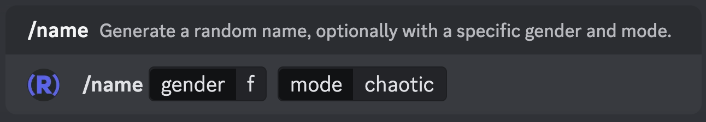

# randomnamecord
Discord app for random BehindTheName names

## Usage

Commands:
 * `/name [gender: m|f|u] [mode: standard|chaotic]`

   Generate a random name, optionally with a specific gender and mode.

   The gender options are m, f, u. Passing "u" will generate an androgynous name; leaving gender blank will generate a name of any gender.

   The generation modes are as follows:

   * `coherent`: will attempt to generate a name with a coherent given name and surname.
   * `chaotic`: will generate a given name and surname completely at random.
 * `/about_name [name: string]`

   Get details about your nickname or a specific name.

   With no arguments, this will attempt to look up your Discord nickname on BehindTheName.

   With an argument, this will attempt to look up the name you passed on BehindTheName.

   For first or last names that contain spaces, this is currently slightly broken. You can get around this by replacing the spaces with "00", e.g.:

   `/about_name` name: `Mary00Ann Van00Buren`
 * `/help_rnc [command: string]
   
   Show the help menu or show help for a specific command

As an example:

